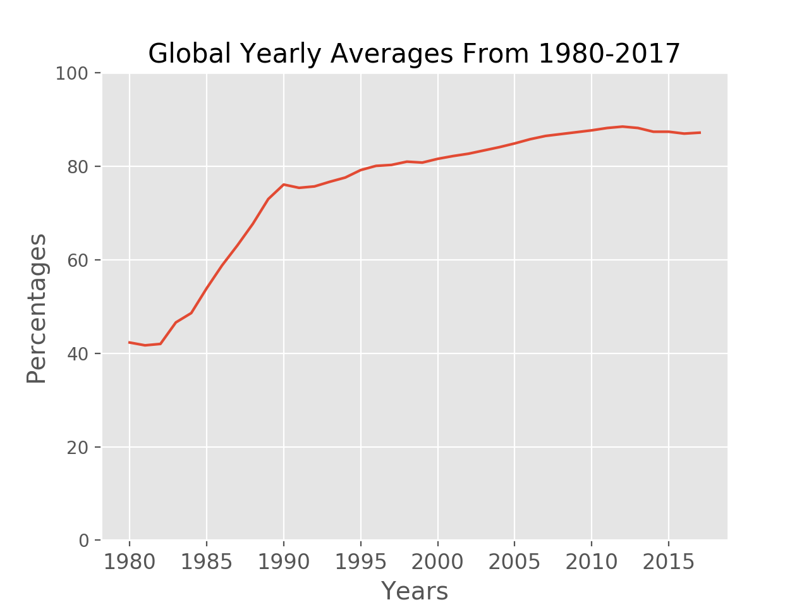
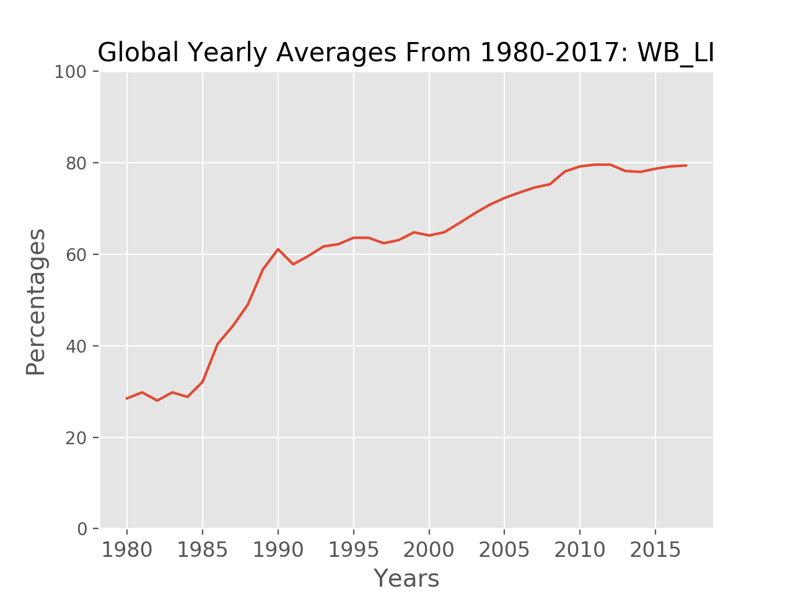
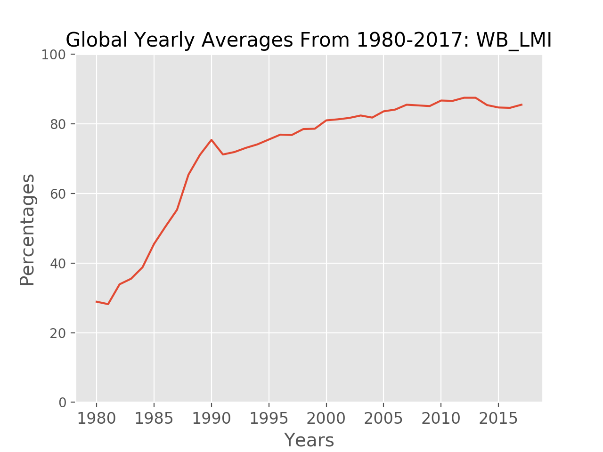
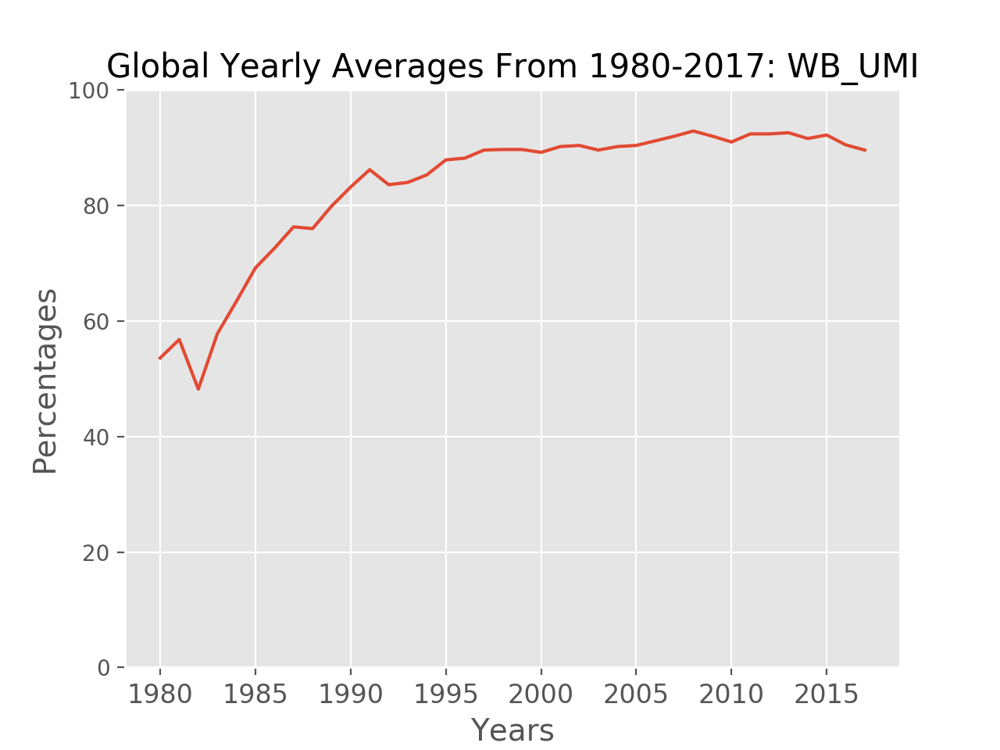
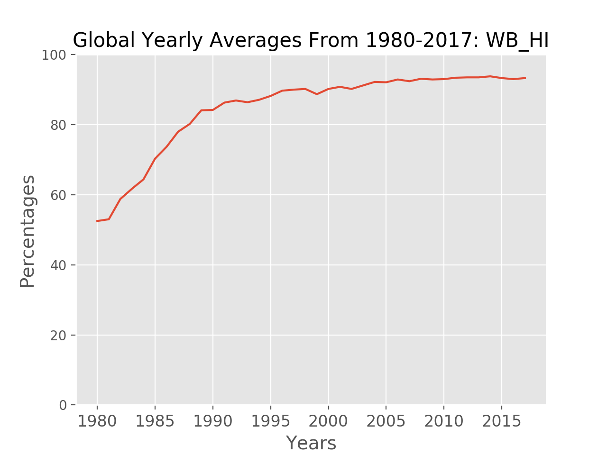
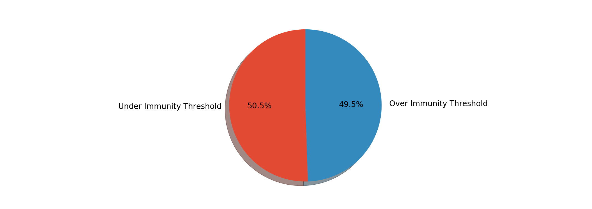
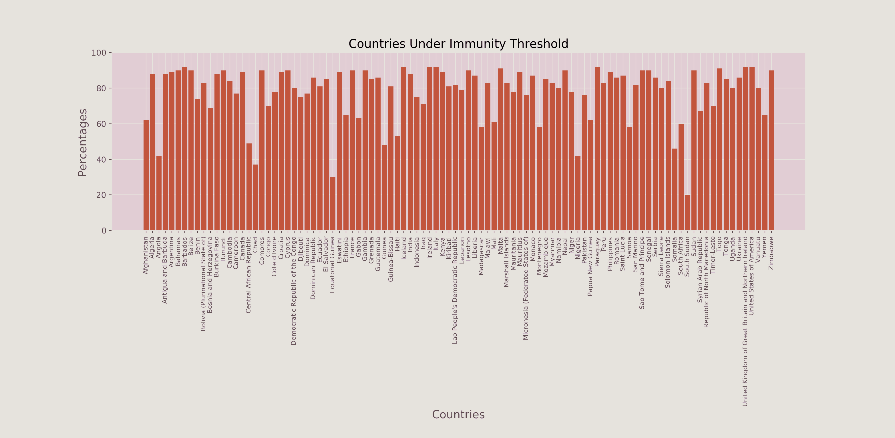
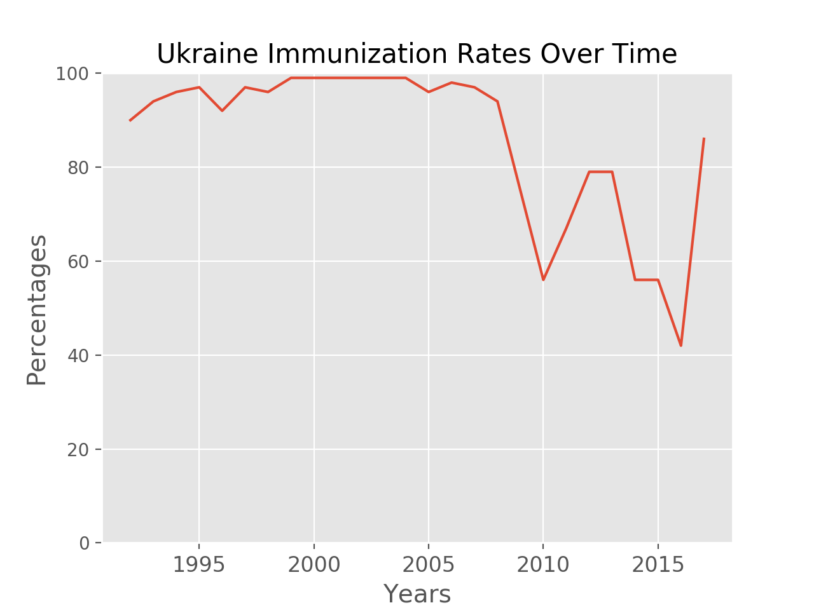
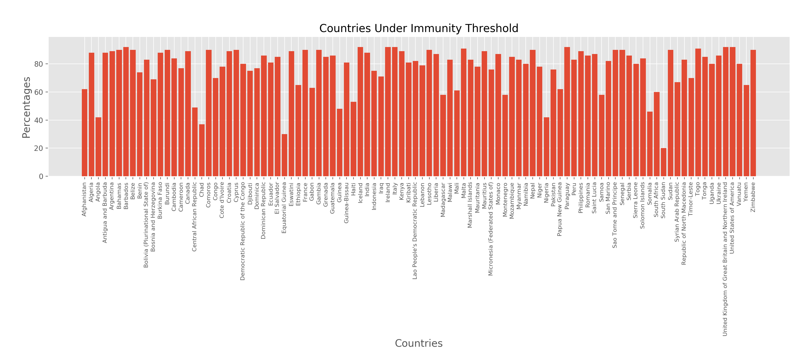

# MeaslesVisualization
A data analysis program which processes a World Health Organization dataset regarding global measles immunization over time. 

The program allows for queries and visualization of the data. 
This output was used to write a report which analyzed the trends. 

Created using Python with NumPy, Matplotlib, and Pandas.

